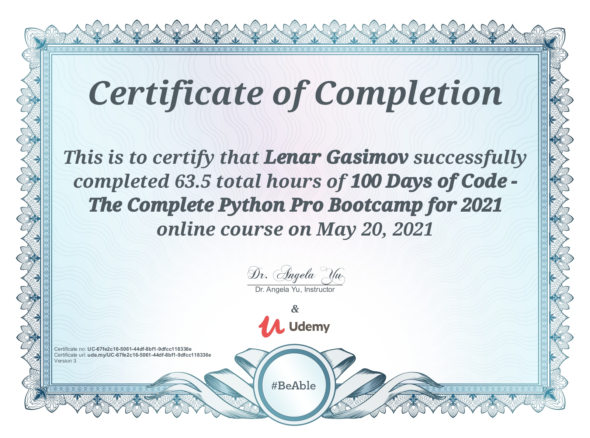

<h1 align="center">100 Days of Python 🐍 
    
</h1>

    
    
    

I'm completed in "100 Days of Code - The Complete Python Pro Bootcamp for 2021" course from Udemy.
Since my goal is to master Python, I chose to take this course in the hope it would provide more structure and better
guidance than I was getting while "self-learning".
While taking part in this course, I have been taking notes and what-not and attempting all of the course projects to the
best of my abilities.
I'll be using this repo as a way for myself to access them as, if and when I need them.
100 projects in 100 days. All the personal projects for Great professor and great course, really recommend it:
[100 Days of Code - The Complete Python Pro Bootcamp for 2021](https://www.udemy.com/course/100-days-of-code).

## 👨🏻‍🎓 Beginner
- [Day 1](day01): Working with Variables in Python to Manage Data
- [Day 2](day02): Understanding Data Types and How to Manipulate Strings
- [Day 3](day03): Control Flow and Logical Operators
- [Day 4](day04): Randomisation and Python Lists
- [Day 5](day05): Python Loops
- [Day 6](day06): Python Functions & Karel
- [Day 7](day07): Hangman
- [Day 8](day08): Function Parameters & Caesar Cipher
- [Day 9](day09): Dictionaries, Nesting and the Secret Auction
- [Day 10](day10): Function Return Values and the Calculator Project
- [Day 11](day11): Blackjack Capstone Project
- [Day 12](day12): Scope and Namespacing in Python
- [Day 13](day13): Debugging: How to Find and Fix Errors in your Code
- [Day 14](day14): Higher Lower Game Project

## 🏋🏻‍♂️ Intermediate
- [Day 15](day15): Local Development Environment Setup & the Coffee Machine Project
- [Day 16](day16): Object Oriented Programming (OOP)
- [Day 17](day17): The Quiz Project & the Benefits of OOP
- [Day 18](day18): Turtle Graphics and GUIs
- [Day 19](day19): Instances, State and Higher Order Functions
- [Day 20](day20): Build the Snake Game Part 1: Animation & Coordinates
- [Day 21](day21): Build the Snake Game Part 2: Inheritance & List Slicing
- [Day 22](day22): Build Pong: The Famous Arcade Game
- [Day 23](day23): The Turtle Crossing Capstone Project
- [Day 24](day24): Files, Directories and Paths
- [Day 25](day25): Working with CSV Data and the Pandas Library
- [Day 26](day26): List Comprehension & the NATO Pilot's Alphabet
- [Day 27](day27): Tkinter, *args, **kwargs and Creating GUI Programs
- [Day 28](day28): Tkinter, Dynamic Typing and the Pomodoro GUI Application
- [Day 29](day29): Building a Password Manager GUI App with Tkinter
- [Day 30](day30): Errors, Exceptions and JSON Data: Improving the Password Manager
- [Day 31](day31): Capstone Project - Flash Card App

## 💪 Intermediate+
- [Day 32](day32): Send Email (smtplib) & Manage Dates (datetime): The Automated Birthday Wisher
- [Day 33](day33): API Endpoints and API Parameters - ISS Overhead Notifier
- [Day 34](day34): API Practice - Creating a GUI Quiz App
- [Day 35](day35): Keys, Authentication & Environment Variables: Send SMS
- [Day 36](day36): Stock Trading News Alert Project
- [Dau 37](day37): Habit Tracking Pixel Project
- [Day 38](day38): Build a Workout Tracking App that Talks to Google Sheets!
- [Day 39](day39): Capstone Part 1: Flight Deal Finder
- [Day 40](day40): Capstone Part 2: Flight Club!
- [Day 41](day41): Introduction to HTML
- [Day 42](day42): Intermediate HTML
- [Day 43](day43): Introduction to CSS
- [Day 44](day44): Intermediate CSS
- [Day 45](day45): Web Scraping with Beautiful Soup
- [Day 46](day46): Create a Spotify Playlist using the Musical Time Machine
- [Day 47](day47): Create an Automated Amazon Price Tracker
- [Day 48](day48): Selenium Webdriver and Game Playing Bot
- [Day 49](day49): Automating Job Applications on LinkedIn
- [Day 50](day50): Automated Tinder Swiper
- [Day 51](day51): Internet Speed Twitter Complaint Bot
- [Day 52](day52): Instagram Follower Bot
- [Day 53](day53): Automated Data Entry Job
- [Day 54](day54): Introduction to Web Development with Flask
- [Day 55](day55): HTML & URL Parsing in Flask and the Higher Lower Game
- [Day 56](day56): Rendering HTML/Static Files and Name Card Project
- [Day 57](day57): Templating with Jinja and Blog Project
- [Day 58](day58): Bootstrap

## 🚀 Advanced
- [Day 59](day59): Upgraded Blog with Bootstrap
- [Day 60](day60): HTML Forms with Flask
- [Day 61](day61): Building Advanced Forms with WTForms
- [Day 62](day62): Flask, WTForms, Bootstrap and CSV - Coffee & Wifi Project
- [Day 63](day63): Databases and with SQLite and SQLAlchemy
- [Day 64](day64): My Top 10 Movies Website
- [Day 65](day65): Web Design School - How to Create a Website that People will Love
- [Day 66](day66): Building Your Own API with RESTful Routing
- [Day 67](day67): Blog Capstone Project Part 3 - RESTful Routing
- [Day 68](day68): Authentication with Flask
- [Day 69](day69): Blog Capstone Project Part 4 - Adding Users
- [Day 70](day70): Deploying Your Web Application with Heroku
- [Day 71](day71): Data Exploration with Pandas: College Major
- [Day 72](day72): Data Visualisation with Matplotlib: Programming Languages
- [Day 73](day73): Aggregate & Merge Data with Pandas: Analyse the LEGO Dataset
- [Day 74](day74): Google Trends Data: Resampling and Visualising Time Series
- [Day 75](day75): Beautiful Plotly Charts & Analysing the Android App Store
- [Day 76](day76): Computation with NumPy and N-Dimensional Arrays
- [Day 77](day77): Linear Regression and Data Visualisation with Seaborn
- [Day 78](day78): Analysing the Nobel Prize with Plotly, Matplotlib & Seaborn
- [Day 79](day79): The Tragic Discovery of Handwashing: t-Tests & Distributions
- [Day 80](day80): Capstone Project - Predict House Prices

## 👨‍💻 Professional
- [Day 81](day81): Portfolio Project - Text to Morse Code Converter
- [Day 82](day82): Portfolio Project - A website to show off your skills and the things I built
- [Day 83](day83): Portfolio Project - Built a text-based version of the Tic Tac Toe game
- [Day 84](day84): Portfolio Project - A program where you can upload images and add a watermark
- [Day 85](day85): Portfolio Project - A Tkinter GUI desktop application that tests your typing speed
- [Day 86](day86): Portfolio Project - Using Python Turtle, build a clone of the 80s hit game Breakout
- [Day 87](day87): Portfolio Project - Built a website that lists cafes with wifi and power for remote working
- [Day 88](day88): Portfolio Project - Built a todo list website with Flask
- [Day 89](day89): Portfolio Project - Disappearing Text Writing App
- [Day 90](day90): Portfolio Project - Convert PDF to Audiobook
- [Day 91](day91): Portfolio Project - Image Colour Palette Generator
- [Day 92](day92): Portfolio Project - Built a custom web scraper to collect data
- [Day 93](day93): Portfolio Project - Automate the Google Dinosaur Game
- [Day 94](day94): Portfolio Project - Space Invaders
- [Day 95](day95): Portfolio Project - Built a custom website using an API
- [Day 96](day96): Portfolio Project - An eCommerce website with payment processing
- [Day 97](day97): Portfolio Project - Sent a WhatsApp Message with Python
- [Day 98](day98): Portfolio Project - Analysed and Visualise the Space Race
- [Day 99](day99): Portfolio Project - Analyzing Deaths involving Police in the United States
- [Day 100](day100): Portfolio Project - Predicting Earnings using Multivariable Regression

## Tools and technologies

- Python 3
- PyCharm, Jupyter Notebook, Google Colab
- Python Scripting and Automation
- Python Game Development
- Web Scraping
- Beautiful Soup
- Selenium Web Driver
- Request
- WTForms
- Data Science
- Pandas
- NumPy
- Matplotlib
- Plotly
- Scikit learn
- Seaborn
- Turtle
- Python GUI Desktop App Development
- Tkinter
- Front-End Web Development
- HTML 5
- CSS 3
- Bootstrap 4
- Bash Command Line
- Git, GitHub and Version Control
- Backend Web Development
- Flask
- REST
- APIs
- Databases
- SQL
- SQLite
- PostgreSQL
- Authentication
- Web Design
- Deployment with GitHub Pages, Heroku and GUnicorn

This certificate above verifies that Lenar Gasimov successfully completed the course 
[100 Days of Code - The Complete Python Pro Bootcamp for 2021](https://www.udemy.com/course/100-days-of-code)  on 05/20/2021 as taught by Dr. Angela Yu on Udemy. 
The certificate indicates the entire course was completed as validated by the student. 
The course duration represents the total video hours of the course at time of most recent completion.

---

@lenargasimov 🐍 2021

