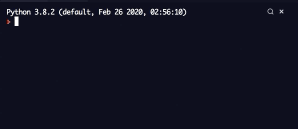

Day 2 - Understanding Data Types and How to Manipulate Strings

## Exercise

- https://repl.it/@lenargasimov/day-2-1-exercise#main.py
- https://repl.it/@lenargasimov/day-2-2-exercise#main.py
- https://repl.it/@lenargasimov/day-2-3-exercise#main.py

## Tip Calculator

https://repl.it/@lenargasimov/tip-calculator-start#main.py