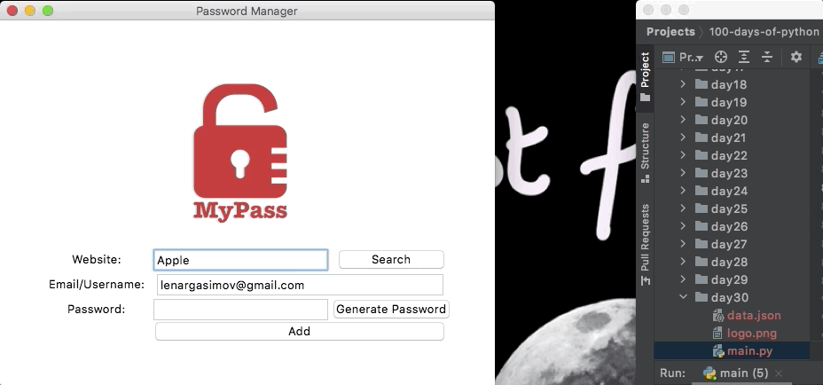

 # Day 30

Learnt about Errors, Exceptions and saving JSON Data in Python. Also, added a search functionality to the Password Manager GUI App with Tkinter.

## Exercise

- https://repl.it/@lenargasimov/day-30-1-exercise#main.py
- https://repl.it/@lenargasimov/day-30-2-exercise#main.py

## Password Manager 2

