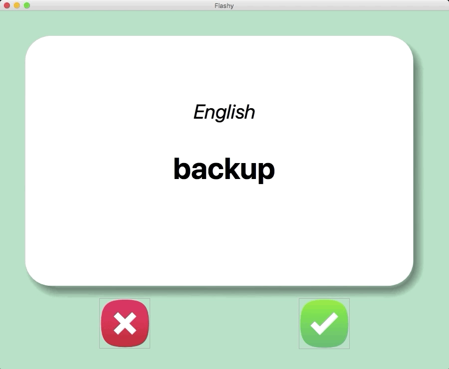

# Day 31

Built a language learning Flash Card App Capstone Project with Tkinter and Pandas. 
A project that translates frequently spoken English computer science words to Russian.

## Flash Card App

