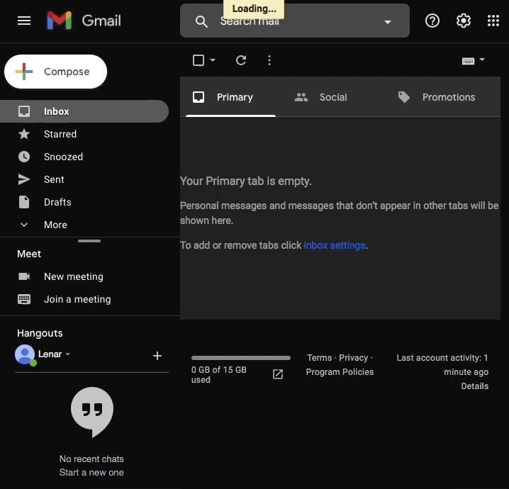

# Day 32

Learnt about Python's SMTP library, Date time library and built an Automated Birthday Wisher that runs every single day with the use of http://pythonanywhere.com, with a list of birthday dates. 

## Automated Birthday Wisher

