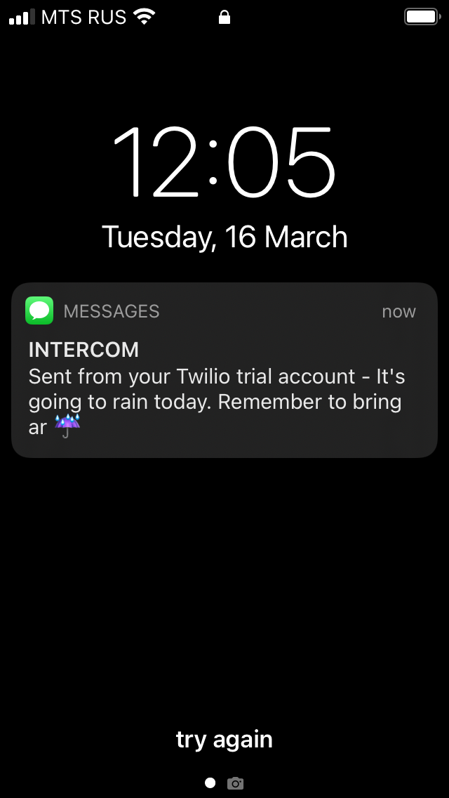

# Day 35

Learnt about env variables and built a rain alert application using open weather map API and deployed it in http://pythonanywhere.com to get daily SMS notifications using Twilio API on weather in my current location.

## Rain Notification

