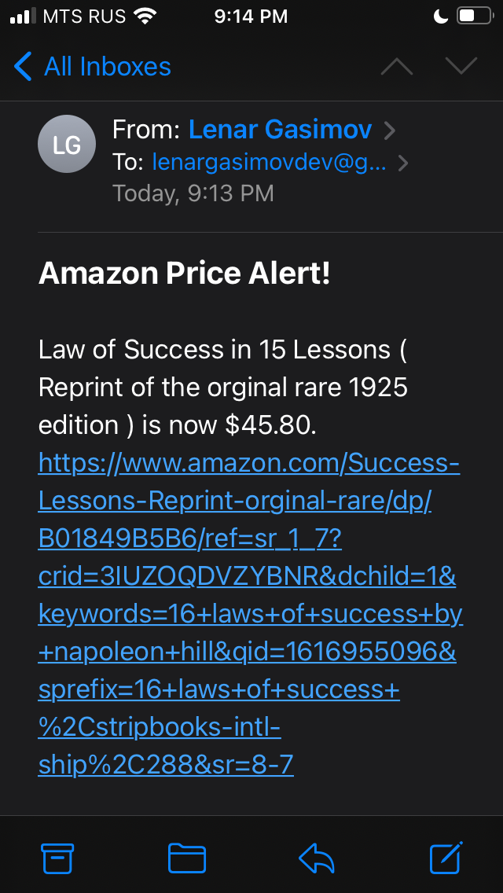

# Day 47

Using BeautifulSoup created an automated Amazon price tracker, doing web scraping, and if the price assigned is lower then sends an alert email using smtplib module.

## Amazon Price Tracker

