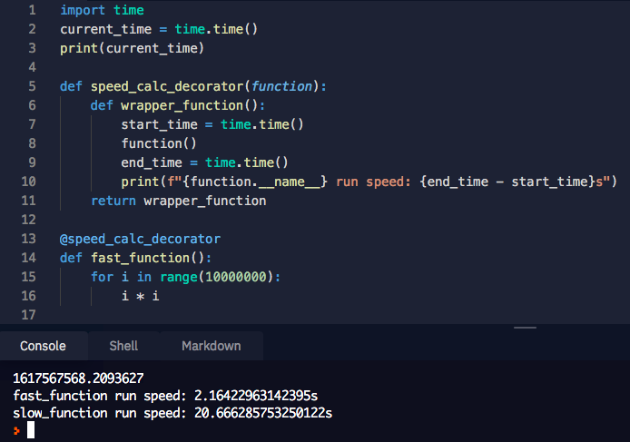

# Day 54

Learnt about backend development using Flask and about Python decorators, as well as some special attributes.

## Decorator

- https://replit.com/@lenargasimov/day-54-1-exercise-1#main.py

