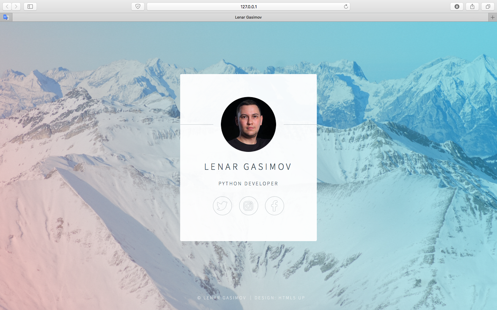

# Day 56

 Learnt about rendering of HTML, CSS using Flask and created a name card website and I used a template from https://html5up.net. 

 ## Rendering HTML/Static Files and and Name Card Project

 
