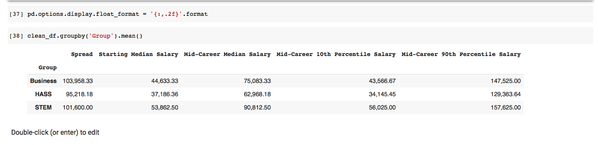

# Day 71

Learnt such a lot things like: explore a Pandas DataFrame, NaN (not a number) values and clean your data ,select particular columns, rows, and individual cells, sorting data.

## Data Exploration with Pandas

