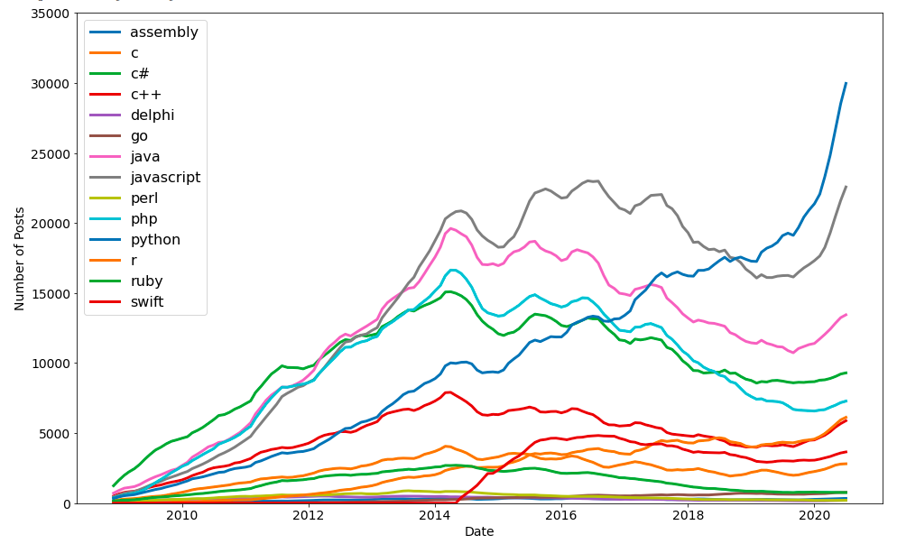

# Day 72

Scratched the surface with the topic of data visualization with Matplotlib, and created a chart of most popular programming languages over time.
https://drive.google.com/file/d/1kSTzZA8LfcNkd5cDT29yWI6L29PiWERk/view?usp=sharing

## Data Visualization with Matplotlib

