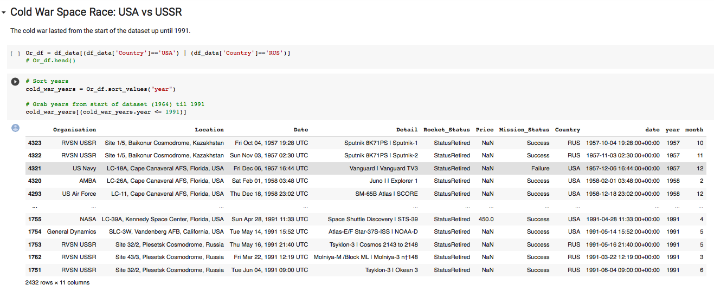

# Day 98

Used space mission data from 1957 onwards to analyse and visualise trends over time.

## Analysed and Visualise the Space Race

## ✔️ Author

 
  

<b>Lenar Gasimov</b> Python developer | Python, Django, Flask.

 

<h4>

🚧 Under construction... 🚧

</h4>